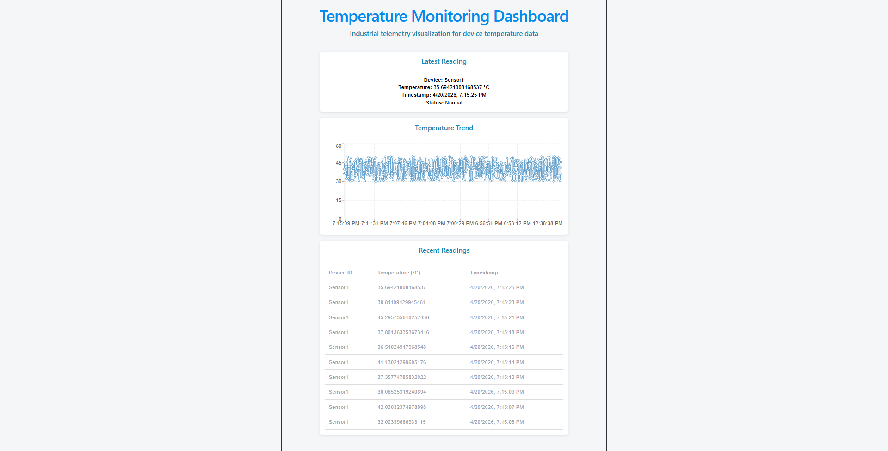

# Temperature Monitoring Dashboard (React)

A React-based dashboard for visualizing industrial temperature telemetry data from a distributed IIoT system.

This project is part of a full-stack IIoT simulation system:
Device → Gateway → API → Database → Dashboard

---

## Dashboard Preview



---

## Features

- Live temperature data visualization
- Latest reading overview
- Temperature trend chart
- Historical data table
- Status indicator (Normal / Warning)

---

## Frontend Structure

The dashboard is built with a modular React structure:

- **App.jsx** – orchestrates data fetching and global state  
- **telemetryApi.js** – handles API communication (Axios)  
- **TemperatureCard** – displays latest reading  
- **TemperatureChart** – visualizes trends  
- **ReadingsTable** – shows historical data  

### Data Flow

1. Dashboard loads → triggers API calls  
2. Data is fetched via Axios  
3. State is stored in React components  
4. Components render UI based on state  

### Design Considerations

- Separation of API logic from UI components  
- Clear data flow from API → state → UI  
- Modular component design for scalability  
- Lightweight frontend with focus on data visualization  

---

## System Architecture

This dashboard is part of a distributed system:

Device Simulator → .NET Worker → ASP.NET API → MongoDB Cloud Database → React Dashboard

---

## API Integration

The dashboard fetches data from:

- `GET /temperature` → returns all readings  
- `GET /temperature/latest` → returns latest reading  

---

## Tech Stack

- React (Vite)
- Axios
- Recharts
- JavaScript

---

## How to Run

### 1. Start Backend API
Ensure the API is running at:
http://localhost:5244

### 2. Start Dashboard

```bash
npm install
npm run dev
```
> Note: The dashboard depends on the backend API and will not display data if:
> - API is not running
> - Worker is not sending data
> - Database is not accessible

## Challenges & Learnings

- Debugged API 500 errors caused by MongoDB deserialization issues  
- Fixed `_id` mapping between MongoDB and C# models  
- Resolved database connectivity issues (IP whitelisting)  
- Used browser Network tab and backend logs for full-stack debugging

## Author

**Hamza Maach**  
Industrial Software Engineer (C# / IIoT / Automation)

- GitHub: https://github.com/Ham15-art